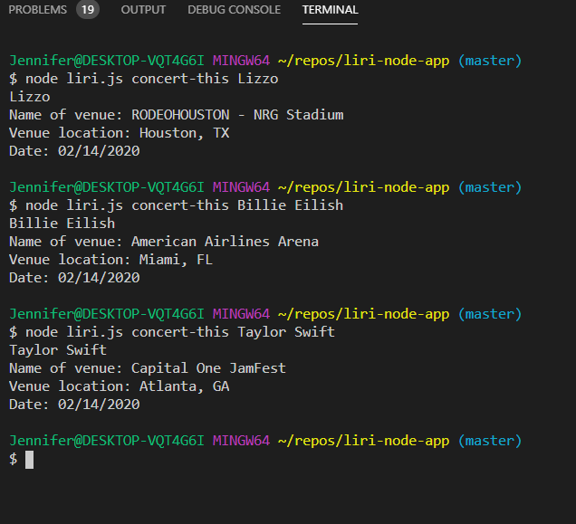
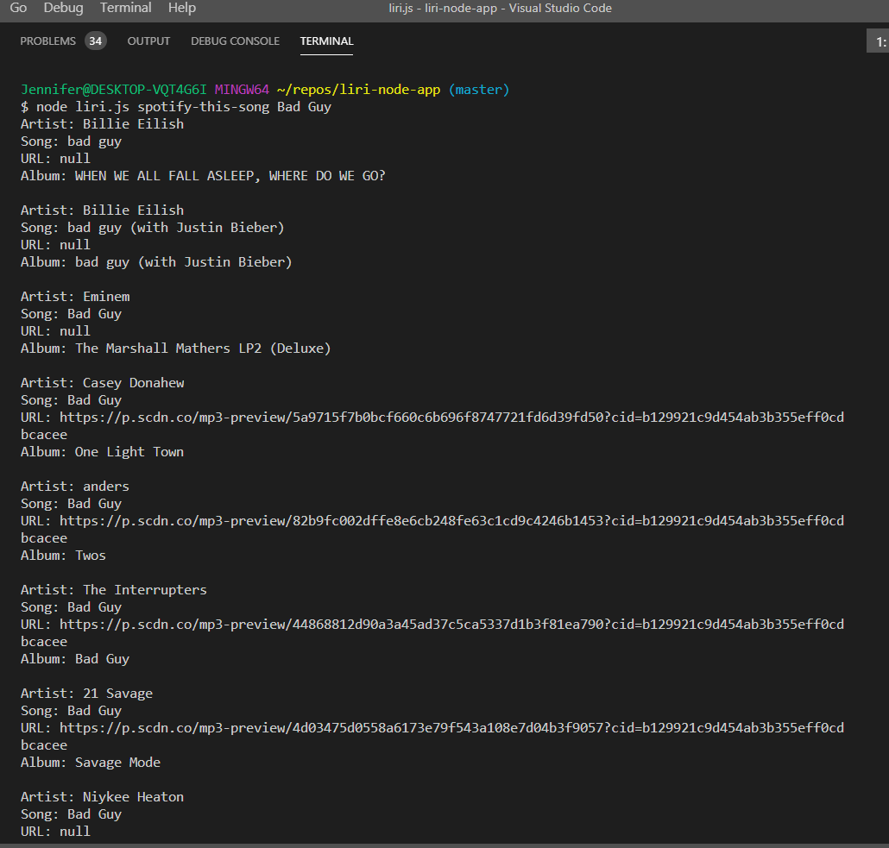
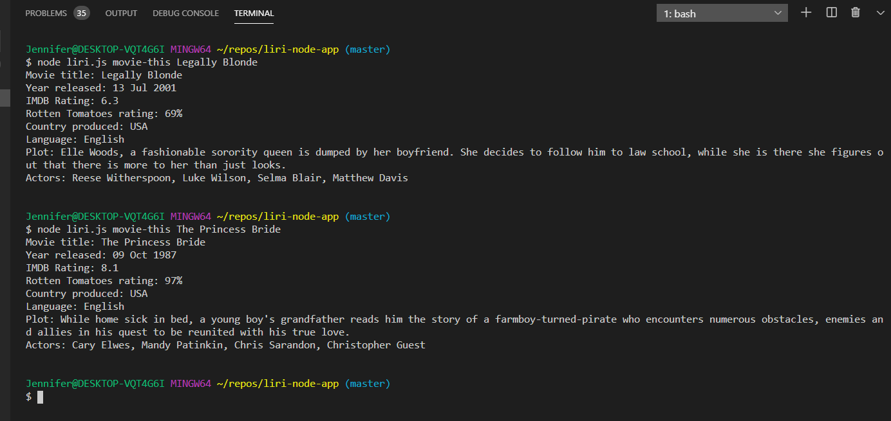

# Liri-node-app

Liri is a Language Interpretation and Recognition Interface. This application is run from the command line. It takes in parameters and returns data based upon the parameters entered. Commands that Liri accepts:

* concert-this
* spotify-this-song
* movie-this
* do-what-it-says

## To Start This App
Npm packages will be necessary to run Liri. Open your terminal  and install:
* axios
* moment
* node-spotify-api
* dotenv

API keys are needed from **Bands In Town API** and **OMDB API**.
* [OMDB API](http://www.omdbapi.com)
* [Bands In Town API](http://www.artists.bandsintown.com/bandsintown-api)

The **spotify-this-song** command will require a client ID and client Secret from Spotify. After generating these credentials, store them in a .env file. Make sure to add the .env file to your .gitignore file so the credentials will not be shared.
* [Spotify](https://developer.spotify.com/my-applications/#!/)

## To Use This App
In Terminal, enter one of the following four commmands plus applicable data to retrieve information.
#### concert-this
This command takes the name of an artist and returns the date, venue, and locations of their next concert.

#### spotify-this-song
This command takes the name of a song and returns the artists, the song name, the album the song is from, and a preview url for the song. 

#### movie-this
This command takes the name of a movie and returns the title, year the movie was released, imdb rating, Rotten Tomatoes rating, country of production, language and plot of the movie, and actors in the movie.

#### do-what-it-says
This command reads the random.txt file and uses data in there to perform the command requested. In this example, it is telling Liri to spotify-this the song "I Want it That Way".

## Built With
* Javascript
* Node
* NPM
* Spotify API
* Bands In Town API
* OMDB API
* Git
* GitHub

### Code written by: Jennifer Moundanos
